<p align="center">
  = 20" />
  
  
  
  
</p>

<h1 align="center">Cortex</h1>

<p align="center">
  <strong>A local-first intelligence server that gives AI coding agents persistent memory, structural awareness, and deterministic enforcement across your entire codebase.</strong>
</p>

<p align="center">
  <code>AI suggests. Git validates. Manifest enforces. Human approves.</code>
</p>

---

## The Problem

AI coding agents (Cursor, Claude Code, Copilot) generate code without awareness of:

- **Project architecture** — they suggest patterns that contradict your norms
- **Past decisions** — lessons learned in previous PRs are forgotten
- **Dependency structure** — they modify files without understanding impact
- **Conventions** — nothing prevents a commit that silently breaks them

There is no system that maintains a **persistent, structured knowledge base** of a codebase and exposes it to **any** AI agent in a deterministic, verifiable way.

## The Solution

**Cortex** is a central MCP server running on `localhost` that:

1. **Captures** developer intent as structured knowledge (rules, lessons, preferences)
2. **Maps** codebase structure as a semantic dependency graph via LSP
3. **Syncs** knowledge with code changes through Git
4. **Enforces** synchronization deterministically via pre-commit hooks + SHA-256 manifests
5. **Exposes** everything to AI agents via [Model Context Protocol](https://modelcontextprotocol.io/) over Streamable HTTP

One server process. Multiple repos. Multiple agents. Zero cloud dependencies.

---

## Architecture

```
┌──────────────────────────────────────────────────────────────────────┐
│                      AI Agents (Multiple Clients)                    │
│  ┌──────────────────┐  ┌──────────────────┐  ┌───────────────────┐  │
│  │ Cursor (Proj A)  │  │ Cursor (Proj B)  │  │ Claude Code (C)   │  │
│  └────────┬─────────┘  └────────┬─────────┘  └────────┬──────────┘  │
└───────────┼──────────────────────┼──────────────────────┼────────────┘
            │     MCP over Streamable HTTP (localhost:4170/mcp)
            ▼                      ▼                      ▼
┌──────────────────────────────────────────────────────────────────────┐
│                  Cortex Central Server (localhost:4170)               │
│                                                                      │
│   /mcp ─── MCP Endpoint        /api/* ─── REST API                   │
│   / ────── React Dashboard      Repo Router ── per-repo routing      │
│                                                                      │
│   ┌────────┐ ┌──────────┐ ┌──────────┐ ┌──────────┐ ┌───────────┐  │
│   │ Repo   │ │Knowledge │ │ Semantic │ │   Git    │ │ Manifest  │  │
│   │Manager │ │  Store   │ │  Graph   │ │ Service  │ │  Engine   │  │
│   └────────┘ └──────────┘ └──────────┘ └──────────┘ └───────────┘  │
│                                                                      │
│   ┌────────┐ ┌──────────┐ ┌──────────┐ ┌──────────┐ ┌───────────┐  │
│   │ Health │ │ Activity │ │ Webhook  │ │  Doc     │ │  Search   │  │
│   │ Score  │ │  Logger  │ │ Service  │ │ Scanner  │ │  Engine   │  │
│   └────────┘ └──────────┘ └──────────┘ └──────────┘ └───────────┘  │
│                                                                      │
│   Storage: ~/.cortex/knowledge.db (single central SQLite DB)         │
└──────────────────────────────────────────────────────────────────────┘
```

---

## Quick Start

### Prerequisites

- **Node.js** >= 20
- **Git** installed and available in PATH

### Install & Run

```bash
# Clone the repository
git clone https://github.com/your-username/cortex.git
cd cortex

# Install dependencies
npm install

# Build the project (server + React UI)
npm run build

# Start the central server
npx cortex serve
```

The server starts at **http://localhost:4170** with:
- `/` — React dashboard (13 pages)
- `/mcp` — MCP endpoint for AI agents
- `/api/*` — REST API (40+ endpoints)

### Connect Your AI Agent

Add this to your IDE's MCP configuration (e.g., Cursor `mcp.json`):

```json
{
  "mcpServers": {
    "cortex": {
      "url": "http://localhost:4170/mcp"
    }
  }
}
```

No `command`, no `args` — the server is already running. The agent just connects.

---

## Features

### Declarative Knowledge (Memory)

Capture developer intent as versioned, scoped knowledge rules:

| Type | Purpose | Example |
|------|---------|---------|
| **Constraint** | Hard rules that must be followed | *"Use apiClient for all HTTP requests"* |
| **Lesson** | Past issues to avoid | *"Avoid lodash v4.17.20 — prototype pollution"* |
| **Preference** | Style/architectural choices | *"Prefer composition over inheritance"* |

Rules can be scoped as **cross-repo** (all projects), **global** (all branches in a repo), or **branch-specific**. All rules are auto-versioned with full history tracking.

### Semantic Dependency Graph (via LSP)

Language-agnostic code structure mapping using Language Server Protocol:

- Extracts functions, classes, interfaces, imports, and call hierarchies
- Builds a queryable dependency graph stored in SQLite
- Supports incremental rebuilds — only re-analyzes changed files
- Regex-based fallback when LSP servers are unavailable
- Adding a new language = adding a config entry, not writing a parser

**Built-in language server support:** TypeScript/JS, Python, Rust, Go

### Deterministic Manifest Enforcement

SHA-256 manifest hashing ensures knowledge stays in sync with code:

- Pre-commit hooks query the Cortex server to validate staged changes against the manifest
- Commits are blocked when the knowledge base drifts from the code
- Sync → approve → commit: a verifiable, human-in-the-loop workflow

### Multi-Repo Management

One server manages all your projects:

- Repos are auto-discovered on first MCP call (no manual init required)
- Each repo gets isolated rules, graph, and manifest
- Cross-repo rules apply everywhere

### Branch-Aware Knowledge

Each branch maintains its own KB view:

- Branches inherit from parent and store only deltas
- Branch switches preserve context automatically via Git hooks
- Merge conflicts in the KB are surfaced and resolvable via MCP

### Health Scoring

Weighted health scoring (0–100) for each repository's knowledge base:

- **6 factors**: summary coverage, responsibility coverage, graph freshness, manifest freshness, rule count, graph connectivity
- Configurable weights per factor
- Improvement suggestions generated automatically
- Visual gauge in the dashboard

### Document Scanner

Automatic discovery and indexing of project documentation:

- Scans for `README.md`, `docs/`, `.cursor/rules`, `CONTRIBUTING.md`, `CHANGELOG.md`, and more
- Tracks content hashes for change detection
- Extracts file references from documentation
- Full CRUD via REST API

### File Metrics & Hotspot Detection

Git-based file metrics to identify code hotspots:

- Commit frequency (30/90 day windows)
- Author count per file
- Last modified date
- Risk scoring: `(churn * 0.7) + (inbound_deps * 0.3)`
- Visual heatmap mode in the graph viewer

### Activity Logging & Session Tracking

Real-time observability for all server operations:

- In-memory ring buffer (1000 entries) for MCP, REST, and hook calls
- Per-session grouping with session summaries and deltas
- Live tail via **Server-Sent Events (SSE)** streaming
- Filterable by source, action, repo, status, and time range
- Aggregate statistics dashboard

### Webhook System

Outbound webhooks for external integrations:

- Subscribe to events: `rule.created`, `rule.updated`, `manifest.generated`, `repo.registered`, `sync.completed`, `hook.triggered`
- HMAC-SHA256 signed payloads
- Per-repo or global scoping
- Enable/disable toggle

### Unified Search

Global `Cmd+K` search across the entire knowledge base:

- Searches rules (content + tags), graph nodes (file paths + symbols + summaries), and documents (titles + paths)
- Cross-repo by default
- Keyboard-driven overlay in the UI

### React Dashboard

A modern web UI at `localhost:4170` with 13 pages:

| Page | Description |
|------|-------------|
| **Dashboard** | Cross-repo overview with health scores, activity heatmap, repo cards |
| **Graph Viewer** | Interactive D3 force-directed dependency visualization with churn heatmap |
| **Health Score** | Circular SVG gauge with factor breakdown and improvement suggestions |
| **Documents** | Indexed project documentation browser |
| **Rule Manager** | CRUD with inline editing, filtering, version history, impact analysis |
| **Manifest Status** | Real-time sync state and drift indicators |
| **Context Inspector** | Preview exactly what an AI agent sees for any file |
| **Branches** | Branch-aware KB management with delta views |
| **Conflicts** | KB merge conflict resolution |
| **Activity Logs** | Filterable logs with live SSE tail and statistics |
| **Sessions** | MCP session replay with timeline and deltas |
| **Webhooks** | Webhook registration and management |
| **Search** | Global Cmd+K overlay searching rules, nodes, and docs |

---

## Screenshots

### Dashboard

Cross-repo overview showing registered repositories, health scores, activity heatmap, server info, and quick-start snippets.

<p align="center">
  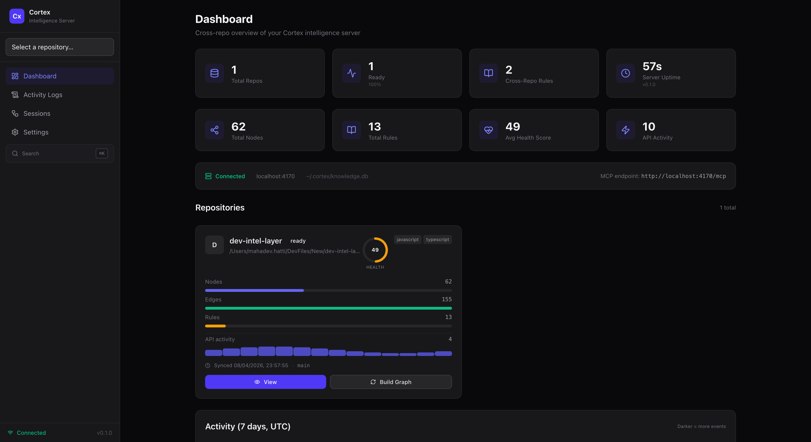
</p>

### Dependency Graph

Interactive D3 force-directed graph visualizing all file-level imports and dependencies. Filterable by language, colorable by language or directory, with churn-based heatmap mode.

<p align="center">
  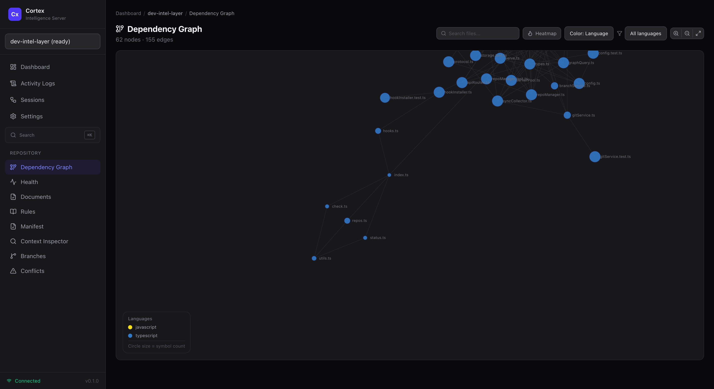
</p>

### Health Score

Circular SVG gauge showing the repository's weighted health score (0–100) with individual factor breakdown and improvement suggestions.

<p align="center">
  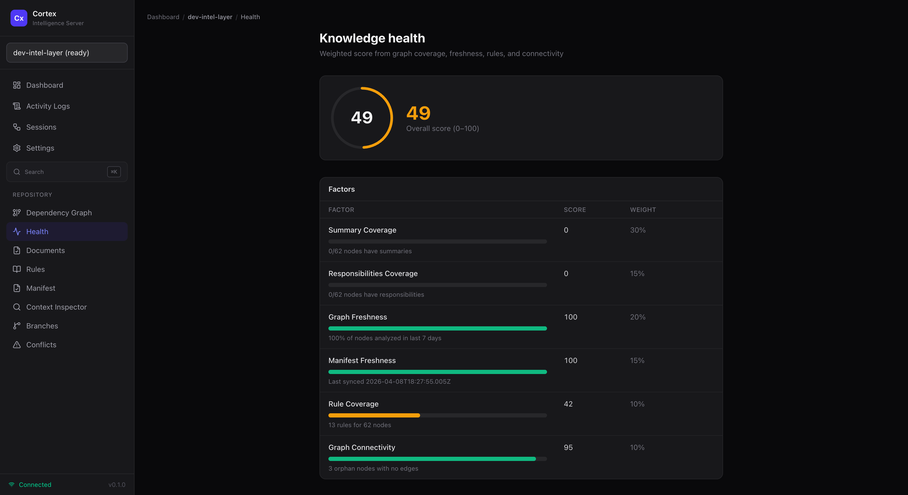
</p>

### Document Viewer

Browse indexed project documentation — README files, Cursor rules, changelogs, and more — with content preview and file references.

<p align="center">
  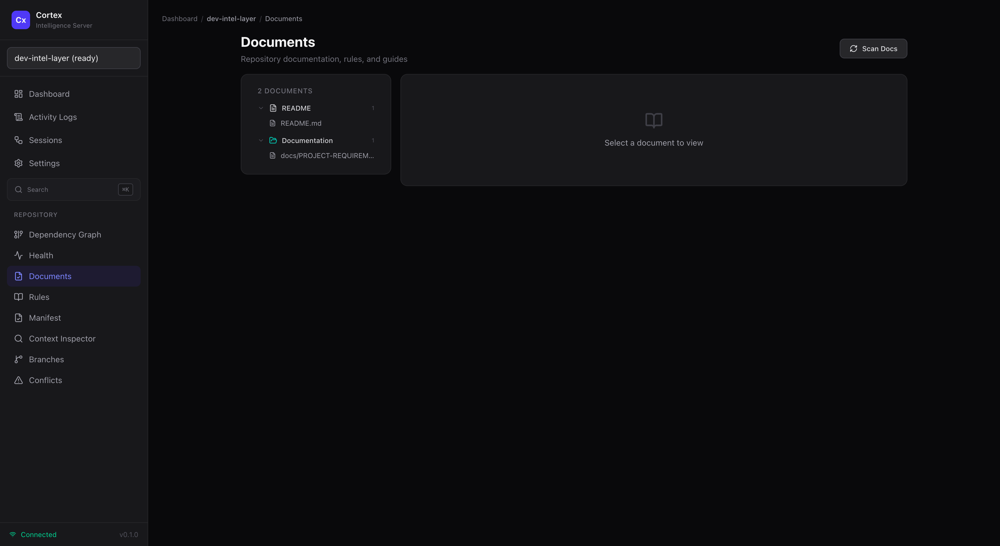
</p>

### Rule Manager

Full CRUD interface for knowledge rules (constraints, lessons, preferences) with inline editing, type/scope filters, tag display, version history, and impact analysis.

<p align="center">
  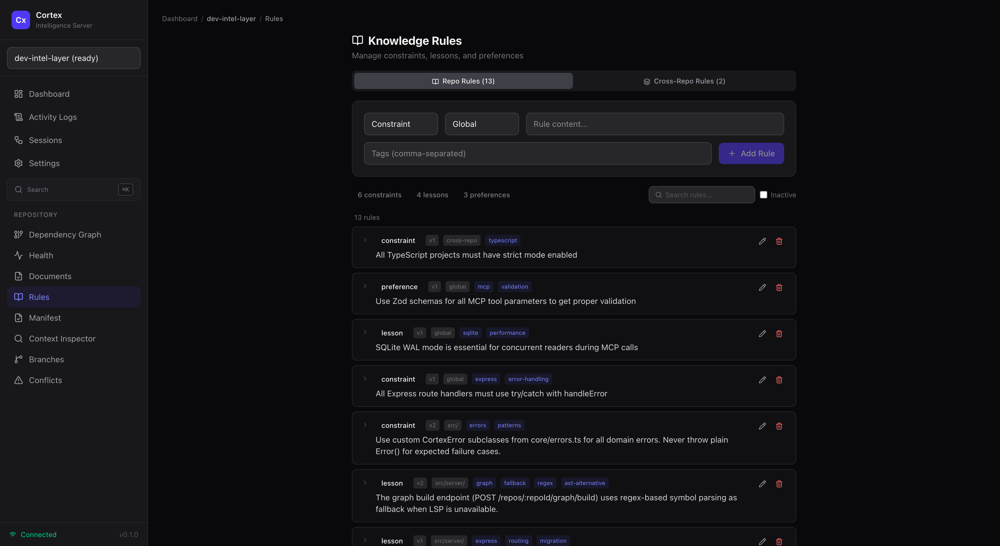
</p>

### Manifest Status

Real-time synchronization state showing SHA-256 hashes, branch info, node/edge/rule counts, and a collapsible file tree of all indexed files.

<p align="center">
  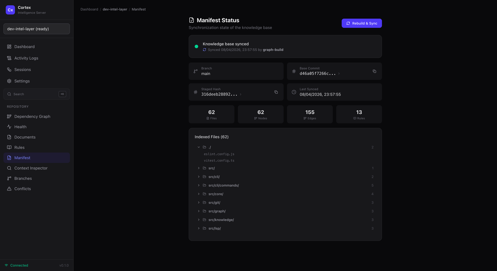
</p>

### Context Inspector

Preview the structured context that an AI agent receives for any file — including applicable rules, dependencies, and graph neighbors.

<p align="center">
  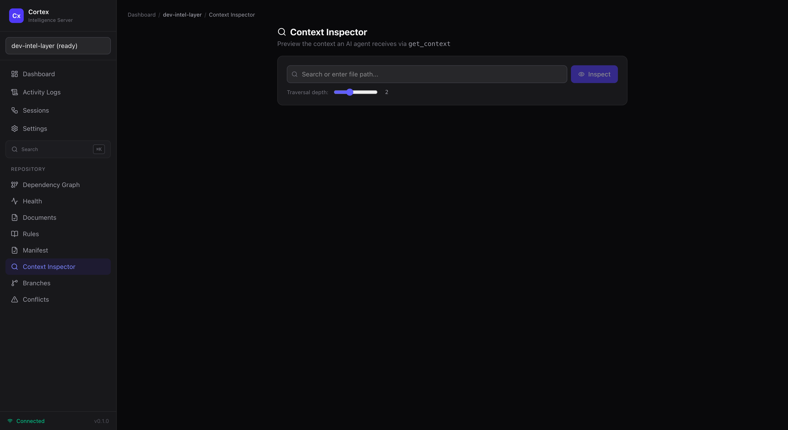
</p>

### Branches

Branch-aware knowledge base management — view branches, their rule counts, and switch KB context.

<p align="center">
  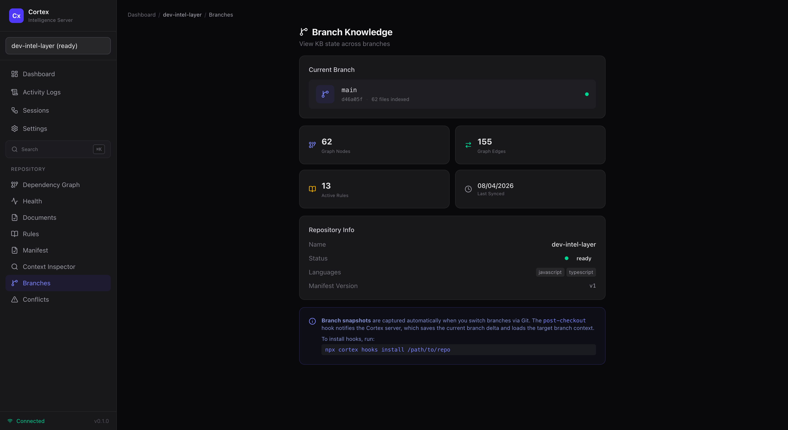
</p>

### Conflict Resolver

Surface and resolve knowledge base conflicts that arise during branch merges.

<p align="center">
  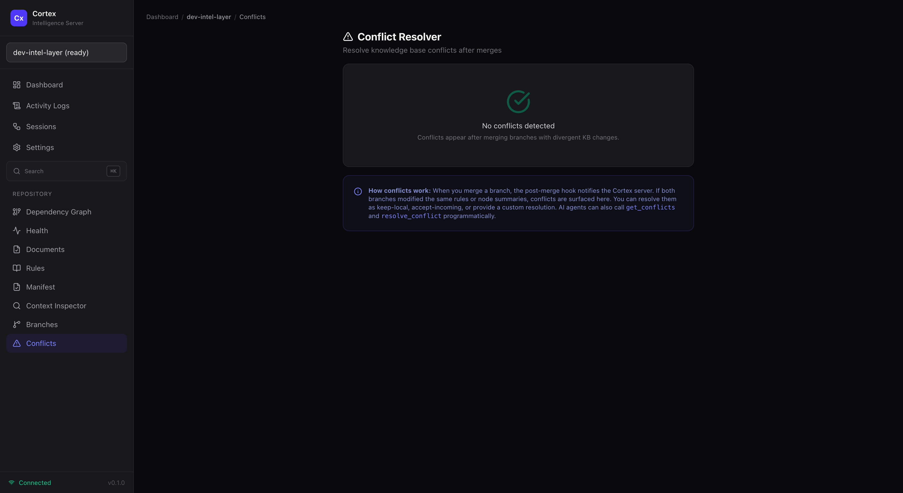
</p>

### Activity Logs

Real-time activity logging with filters by source/action/status, live SSE tail, and aggregate statistics.

<p align="center">
  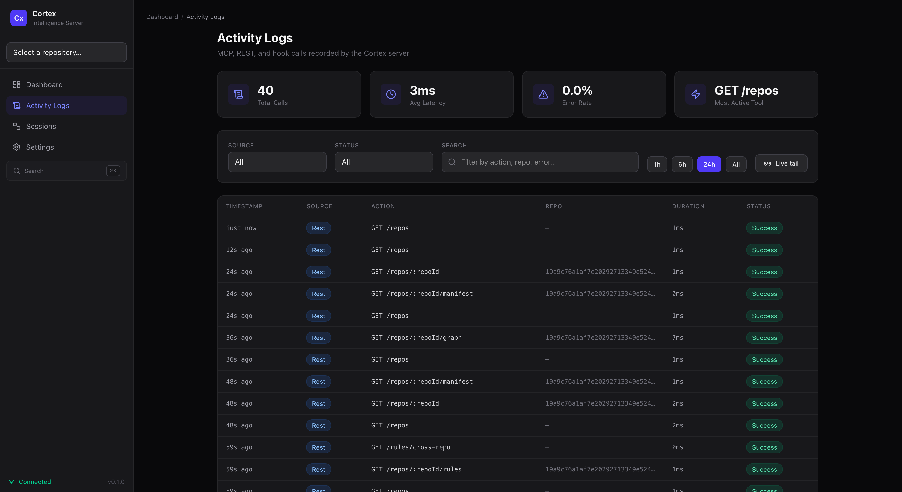
</p>

### Session Replay

MCP session timeline with call details, duration tracking, and session deltas.

<p align="center">
  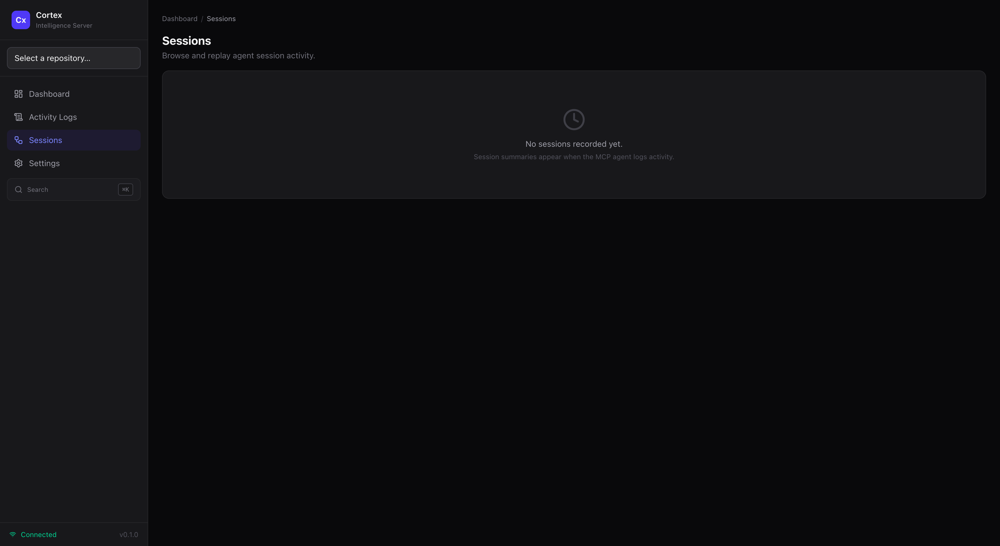
</p>

### Webhook Manager

Register, toggle, and manage outbound webhooks with event filtering and HMAC-SHA256 signatures.

<p align="center">
  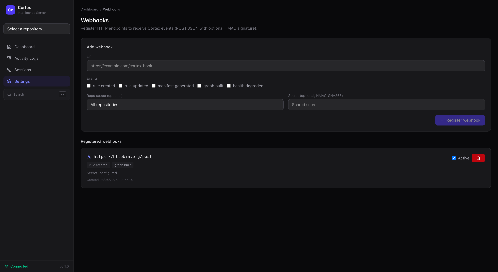
</p>

---

## MCP Tools

All repo-scoped tools accept a `repoPath` parameter to identify the target project.

| Tool | Description |
|------|-------------|
| `list_repos` | List all registered repos with status |
| `get_repo_status` | Detailed status of a specific repo |
| `sync_kb` | Collect sync data (staged files, diff, affected nodes, rules) |
| `apply_kb_updates` | Persist human-approved KB updates and refresh manifest |
| `get_context` | Get structured context for AI agent coding assistance |
| `get_rules` | List knowledge rules with optional filters |
| `add_rule` | Add a new knowledge rule |
| `update_rule` | Modify an existing rule (auto-increments version) |
| `get_graph` | Query the dependency graph or subgraph |
| `get_manifest` | Read current manifest state |
| `init_kb` | Explicitly bootstrap a repo's knowledge base |

### MCP Resources

| URI | Description |
|-----|-------------|
| `kb://repos` | All registered repos |
| `kb://rules/cross-repo` | Cross-repo rules |

---

## REST API

### Core Endpoints

| Method | Endpoint | Description |
|--------|----------|-------------|
| GET | `/api/health` | Server health check |
| GET | `/api/repos` | List all repos |
| POST | `/api/repos` | Register a repo by path |
| GET | `/api/repos/:repoId` | Repo details + manifest + stats |

### Graph Endpoints

| Method | Endpoint | Description |
|--------|----------|-------------|
| GET | `/api/repos/:repoId/graph` | Query dependency graph |
| POST | `/api/repos/:repoId/graph/build` | Trigger graph build for a repo |
| GET | `/api/repos/:repoId/graph/metrics` | File-level git metrics (churn, authors) |

### Rule Endpoints

| Method | Endpoint | Description |
|--------|----------|-------------|
| GET | `/api/repos/:repoId/rules` | List rules (filterable by type/scope/active) |
| POST | `/api/repos/:repoId/rules` | Create a rule |
| PUT | `/api/repos/:repoId/rules/:id` | Update a rule |
| GET | `/api/repos/:repoId/rules/:id/history` | Version history for a rule |
| GET | `/api/repos/:repoId/rules/:id/impact` | Impact analysis for a rule |
| GET | `/api/rules/cross-repo` | Cross-repo rules |
| POST | `/api/rules/cross-repo` | Create cross-repo rule |

### Knowledge Endpoints

| Method | Endpoint | Description |
|--------|----------|-------------|
| GET | `/api/repos/:repoId/manifest` | Current manifest |
| GET | `/api/repos/:repoId/context` | Context for a file (what an AI agent sees) |
| GET | `/api/repos/:repoId/stats` | Node/edge/rule counts |
| GET | `/api/repos/:repoId/health` | Health score with factor breakdown |

### Document Endpoints

| Method | Endpoint | Description |
|--------|----------|-------------|
| GET | `/api/repos/:repoId/docs` | List indexed documents |
| GET | `/api/repos/:repoId/docs/:docId` | Document metadata |
| GET | `/api/repos/:repoId/docs/:docId/content` | Document content |
| GET | `/api/repos/:repoId/docs/:docId/references` | File references in document |
| POST | `/api/repos/:repoId/docs/scan` | Trigger document re-scan |

### Observability Endpoints

| Method | Endpoint | Description |
|--------|----------|-------------|
| GET | `/api/logs` | Query activity logs (filterable) |
| GET | `/api/logs/stats` | Aggregate log statistics |
| GET | `/api/logs/stream` | SSE stream for live log tail |
| GET | `/api/sessions` | List MCP sessions |
| GET | `/api/sessions/:id` | Session detail |
| GET | `/api/sessions/:id/delta` | Session delta (changes made) |
| GET | `/api/analytics` | Cross-repo analytics with activity trends |

### Integration Endpoints

| Method | Endpoint | Description |
|--------|----------|-------------|
| GET | `/api/webhooks` | List webhooks |
| POST | `/api/webhooks` | Register a webhook |
| PUT | `/api/webhooks/:id` | Toggle webhook active/inactive |
| DELETE | `/api/webhooks/:id` | Remove a webhook |
| GET | `/api/search?q=` | Unified search across rules, nodes, docs |
| POST | `/api/repos/notify` | Git hook event notifications |
| GET | `/api/repos/manifest?repoPath=` | Manifest lookup by path (for hooks) |

---

## CLI Commands

```bash
# Server
npx cortex serve                        # Start on localhost:4170
npx cortex serve --port 4180            # Custom port
npx cortex serve --no-ui                # Skip auto-opening browser

# Repo management
npx cortex repos                        # List registered repos
npx cortex repos add /path/to/repo      # Manually register a repo
npx cortex repos remove <repoId>        # Unregister a repo

# Per-repo operations (server must be running)
npx cortex status /path/to/repo         # KB status + manifest
npx cortex check /path/to/repo          # Validate manifest (like pre-commit)

# Git hooks
npx cortex install-hooks /path/to/repo  # Install pre-commit, post-merge, post-checkout
npx cortex uninstall-hooks /path/to/repo
```

---

## Configuration

### Central Config: `~/.cortex/config.json`

```json
{
  "version": 1,
  "server": { "port": 4170, "host": "localhost" },
  "storage": { "path": "~/.cortex", "database": "knowledge.db" },
  "ui": { "autoOpen": true },
  "languageServers": {
    "typescript": { "enabled": true, "command": "typescript-language-server", "args": ["--stdio"] },
    "python": { "enabled": true, "command": "pyright-langserver", "args": ["--stdio"] }
  },
  "graph": {
    "ignorePaths": ["node_modules", "dist", "build", ".git", "coverage"],
    "maxFileSize": 1048576
  },
  "lspPool": { "idleTimeoutMs": 300000 }
}
```

### Per-Repo Overrides: `<repo-root>/.cortex.json`

```json
{
  "languageServers": { "python": { "enabled": false } },
  "graph": { "ignorePaths": ["node_modules", "dist", "generated"] }
}
```

Per-repo values override central defaults at the key level.

---

## Project Structure

```
cortex/
├── src/
│   ├── core/                  # Types, config, SQLite storage (8 tables), errors
│   ├── repo/                  # Repo manager + request router
│   ├── git/                   # Git operations, diff parsing, hook installer, file metrics
│   ├── lsp/                   # Language server registry, pool, protocol helpers
│   ├── graph/                 # Graph builder (LSP + regex fallback), queries, incremental updates
│   ├── knowledge/             # Rule service, branch service, conflict resolver, health scoring
│   ├── manifest/              # Manifest generation, SHA-256 hash computation
│   ├── sync/                  # Sync orchestration + data collection for agents
│   ├── docs/                  # Document scanner + document service
│   ├── server/                # Express HTTP server, MCP endpoint, REST routes,
│   │                          # activity logging, webhook service
│   ├── cli/                   # CLI entry point + commands (serve, repos, status, etc.)
│   ├── ui/                    # Vite + React 19 + Tailwind CSS 4 dashboard
│   │   ├── components/        # 13 page components (Dashboard, GraphViewer, HealthScore,
│   │   │                      #   DocumentViewer, RuleManager, ManifestStatus, ContextInspector,
│   │   │                      #   BranchSelector, ConflictResolver, ActivityLogs, SessionReplay,
│   │   │                      #   WebhookManager, HotspotList, SearchOverlay, Layout)
│   │   ├── hooks/             # TanStack Query hooks (useRepos, useGraph, useHealth,
│   │   │                      #   useLogs, useSessions, useDocs, useAnalytics, etc.)
│   │   └── lib/               # API client (30+ typed methods), D3 graph layout config
│   └── index.ts               # Library exports
├── scripts/                   # Git hook templates (pre-commit, post-merge, etc.)
├── tests/                     # Vitest test suites
├── docs/                      # Project documentation
│   ├── PROJECT-REQUIREMENTS.md    # Full specification & design document
│   ├── SYSTEM-ARCHITECTURE.md     # Auto-generated architecture deep-dive (21 features)
│   └── screenshots/               # UI screenshots
├── package.json
├── tsconfig.json
└── vitest.config.ts
```

---

## Documentation

| Document | Description |
|----------|-------------|
| [Project Requirements](docs/PROJECT-REQUIREMENTS.md) | Complete specification with data models, component specs, phases, and success criteria |
| [System Architecture](docs/SYSTEM-ARCHITECTURE.md) | Auto-generated deep-dive covering all 21 features/subsystems with implementation details, data flow, design decisions, and trade-offs |

---

## How It Works

The knowledge synchronization workflow:

```
1. Developer stages changes
2. AI agent calls sync_kb → Cortex returns staged files, diff, affected nodes, rules
3. AI agent analyzes the data and proposes KB updates
4. Developer reviews and approves
5. AI agent calls apply_kb_updates → Cortex persists changes, refreshes manifest
6. Developer commits → pre-commit hook verifies manifest hash matches staged hash
7. Commit succeeds ✅
```

If the knowledge base is out of sync, the pre-commit hook blocks the commit and guides the developer to run a sync through their AI agent.

---

## Development

```bash
# Start the backend server (with hot reload)
npm run serve

# Start the UI dev server (HMR on port 4171, proxies API to 4170)
npm run dev:ui

# Run tests
npm test

# Run tests in watch mode
npm run test:watch

# Run tests with coverage
npm run test:coverage

# Type checking
npm run typecheck

# Lint & format
npm run lint
npm run format
```

---

## Tech Stack

| Layer | Technology |
|-------|------------|
| **Runtime** | Node.js >= 20 |
| **Language** | TypeScript 5.8 (strict mode) |
| **MCP** | @modelcontextprotocol/sdk (Streamable HTTP) |
| **HTTP** | Express 5 |
| **Database** | better-sqlite3 (WAL mode, 8 tables) |
| **Git** | simple-git |
| **LSP** | vscode-jsonrpc + vscode-languageserver-protocol |
| **CLI** | Commander |
| **Validation** | Zod |
| **UI** | React 19 + Vite + Tailwind CSS 4 |
| **Routing** | React Router 7 |
| **Data Fetching** | TanStack Query 5 |
| **Graphs** | D3.js 7 (force-directed) |
| **Icons** | Lucide React |
| **Testing** | Vitest |

---

## Design Principles

- **AI suggests, humans approve** — no auto-applied knowledge changes
- **Local-first** — all data stays on your machine, zero cloud dependencies
- **Agent-agnostic** — any MCP client connects over HTTP; not tied to one IDE
- **Language-agnostic** — LSP-based graph engine; new languages via config
- **Git-native** — hooks enforce sync; branches maintain independent KB views
- **Deterministic** — SHA-256 manifests make sync state verifiable and reproducible
- **Observable** — every MCP and REST call is logged with session tracking and SSE streaming

---

## Non-Goals

- **Not** an AI model — it is a context engine *for* AI agents
- **Not** a Git replacement — it complements Git
- **Not** cloud-dependent — fully local, localhost-only
- **Not** a linter or formatter — it captures intent, not style

---

## License

[MIT](LICENSE) — Mahadev Hatti
